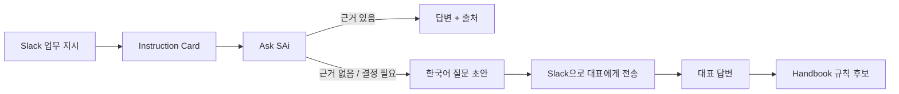

# SAi Frontend

**SAi 웹 클라이언트**

OWNER / MEMBER 역할별 화면과 Instruction Card, Ask SAi, Handbook, Source 연결 UI를 제공합니다.

</div>

---

## Tech Stack

| Category  | Stack              |
| --------- | ------------------ |
| Framework | React 19           |
| Build     | Vite 8             |
| Routing   | React Router DOM 7 |
| HTTP      | Axios              |
| Styling   | styled-components  |
| State     | React Context API  |
| Deploy    | Vercel             |

---

## Main Features

### MEMBER

* **Home**

  * 업무 현황 및 주요 정보 확인

* **Tasks**

  * Instruction Card 조회
  * 업무 상태 관리
  * Task에서 바로 Ask SAi로 이동

* **Ask SAi**

  * Company / Project 범위 선택
  * 사내 지식 기반 질문
  * 답변 근거 및 출처 확인
  * 근거가 없거나 대표 결정이 필요한 경우 한국어 질문 초안 생성
  * Slack을 통한 대표 질문 전송

* **Handbook**

  * 회사 공통 규칙 조회
  * 프로젝트별 규칙 조회

### OWNER

* **Dashboard**

  * 서비스 사용 현황 확인

* **Handbook**

  * 자동 생성된 규칙 검토
  * 승인 / 보류 / 거절

* **Questions**

  * 팀원이 전달한 질문 확인 및 답변

* **Sources**

  * Slack 연결
  * GitHub 연결
  * Local File 업로드

* **Settings**

  * 위험 키워드
  * 근무 시간
  * 회사 설정

---

## Core Flow



---

## Project Structure

```text
src/
├── apis/            # Backend API
├── assets/          # 이미지 / 아이콘
├── components/
│   ├── common/
│   ├── member/
│   └── owner/
├── context/         # Auth / Member 전역 상태
├── hooks/           # Custom Hooks
├── pages/           # Route Page
├── routes/          # Route Guard
├── utils/
├── App.jsx
└── main.jsx
```

### API

API 요청은 `src/apis/`에서 도메인별로 관리합니다.

```text
Component
   ↓
API Module
   ↓
Axios Instance
   ↓
SAi Backend
```

주요 모듈:

```text
auth.js
cards.js
handbook.js
qna.js
sources.js
companies.js
onboarding.js
```

---

## Routing

```text
/login

/owner
├── /owner
└── /owner/onboarding

/member
├── /member/home
├── /member/tasks
├── /member/ask
└── /member/handbook
    ├── /company
    └── /project/:projectId
```

`OWNER`, `MEMBER` 역할에 따라 접근 가능한 Route를 분리합니다.

---

## Authentication

JWT Access / Refresh Token 방식을 사용합니다.

```text
API Request
   ↓
Access Token
   ↓
401 발생
   ↓
Refresh Token
   ↓
Access Token 재발급
   ↓
기존 요청 재시도
```

인증 및 사용자 정보는 `AuthContext`에서 관리합니다.

---

## Ask SAi

Ask SAi에서는 질문 범위를 선택할 수 있습니다.

```text
Company-wide
Project A
Project B
...
```

답변 결과에 따라 UI가 달라집니다.

| 결과       | UI            |
| -------- | ------------- |
| 근거 있음    | 답변 + Citation |
| 근거 없음    | 질문 초안         |
| 대표 결정 필요 | 질문 초안         |
| 관련 없는 질문 | 범위 밖 안내       |

질문에 답할 수 없는 경우 화면을 벗어나지 않고 바로 대표 질문 흐름으로 연결됩니다.

```text
Ask SAi
   ↓
질문 초안
   ↓
Slack Channel 선택
   ↓
대표에게 전송
```

---

## Data Sources

현재 Frontend에서 지원하는 Source입니다.

### Slack

* Workspace 연결
* Channel 선택
* Company / Project 범위 설정

### GitHub

* Repository 연결
* Company / Project 범위 설정

### Local File

지원 형식:

```text
.txt
.md
.pdf
.docx
```

최대 파일 크기:

```text
20MB
```

---

## Getting Started

### Requirements

```text
Node.js ^20.19.0 or >=22.12.0
npm
```

### Install

```bash
npm install
```

### Environment

프로젝트 루트에 `.env.local`을 생성합니다.

```env
VITE_API_URL=http://localhost:8000
```

### Run

```bash
npm run dev
```

### Build

```bash
npm run build
```

### Lint

```bash
npm run lint
```

---

## Deployment

Frontend는 **Vercel**을 기준으로 배포합니다.

Production 환경에서는 다음 환경변수를 설정합니다.

```text
VITE_API_URL=<production-backend-url>
```

배포 전:

```bash
npm run lint
npm run build
```
